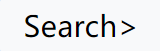
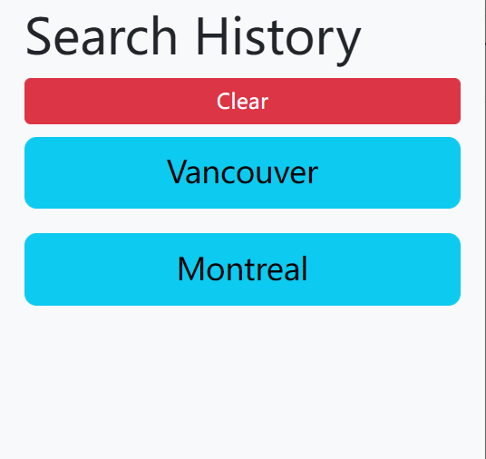

# Weather Dashboard

- [Description](#description)
- [Visualization and Usage](#visualization-and-usage)
  - [Dashboard](#dashboard)
  - [Search for City](#search-for-city)
  - [Search History](#search-history)
- [Contribution](#contribution)
- [License](#license)

## Description

Weather Dashboard is a web application that allows user to obtain current and 5 day forecast weather by city.

## Visualization and Usage

[Click here for Deployed Application](https://hmhtom.github.io/weather-dashboard/)

### Dashboard

> Here is a screenshot for the weather dashboard.

> If you have never used the application before, weather information for Toronto will be launched by default.

> In the current weather section on the top half of the dashboard, you can find **city name, today's date, weather decription and correspondent icon, tempreture, windspeed and humidity** information in the weather card.

> On the bottom half of the page, 5 days forecast card contains **date/times, weather decription icon, tempture, windspeed and humidity** information.

### Search for City

> Click the  button on the top-left of the page to toggle side-search-bar

> Here is how the searcn bar looks like
>
> 
>
> There are 3 format you can search for a city, either enter a `Cityname` like above

> or `Cityname, Countory Code`
>
> 

> or `Cityname, State Code, Country Code`
>
> 

### Search History

> Below search bar you can find your search history ordered from the most recent
>
> 

> You can click on the search history to show the city's weather on dashboard
>
> If you have any search history, most recent history will show instead of default when the application launch

> Search history can be cleared by the clear button

## Contribution

Pull requests are welcome. For major changes, please open an issue first to discuss what you would like to change.

## License

MIT License 

Copyright (c) 2022 hmhtom

Permission is hereby granted, free of charge, to any person obtaining a copy
of this software and associated documentation files (the "Software"), to deal
in the Software without restriction, including without limitation the rights
to use, copy, modify, merge, publish, distribute, sublicense, and/or sell
copies of the Software, and to permit persons to whom the Software is
furnished to do so, subject to the following conditions:

The above copyright notice and this permission notice shall be included in all
copies or substantial portions of the Software.

THE SOFTWARE IS PROVIDED "AS IS", WITHOUT WARRANTY OF ANY KIND, EXPRESS OR
IMPLIED, INCLUDING BUT NOT LIMITED TO THE WARRANTIES OF MERCHANTABILITY,
FITNESS FOR A PARTICULAR PURPOSE AND NONINFRINGEMENT. IN NO EVENT SHALL THE
AUTHORS OR COPYRIGHT HOLDERS BE LIABLE FOR ANY CLAIM, DAMAGES OR OTHER
LIABILITY, WHETHER IN AN ACTION OF CONTRACT, TORT OR OTHERWISE, ARISING FROM,
OUT OF OR IN CONNECTION WITH THE SOFTWARE OR THE USE OR OTHER DEALINGS IN THE
SOFTWARE.
